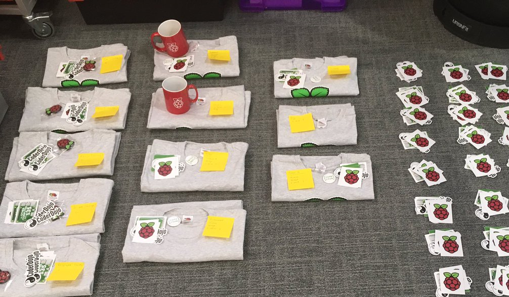

## What's in it for you

There are many benefits to volunteering for the Raspberry Pi Foundation.

### Your skills and development

Volunteering as a translator helps you develop lots of different skills and gain new knowledge. The soft skills you develop are teamworking, communication, time management and attention to detail. You'll gain a thorough understanding of translation and localisation, you will improve your English language skills as well as writing skills in your native language. You will also develop solid research skills and basic knowledge of programming. 

These skills and knowledge can be useful in your day-to-day life, employment or studies. Moreover, we will direct you to **free courses** and will offer you opportunities to participate in **free training** that will help you develop even further. 

### Reference letters, endorsements, and certificates

We can provide reference letters and offer LinkedIn endorsements for the skills you develop as part of our programme. We are also working to introduce Volunteer Certificates, which will be available soon. 

### Recognition scheme

We do our best to recognise the hard work of our amazing volunteers. That’s why we have introduced a recognition scheme that helps us ensure everyone gets the credit they deserve. If you complete at least 10 tasks, you will receive a letter from us with stickers, a pen and a pin badge. The more tasks you complete, the better the rewards – you can get a t-shirt, a magazine subscription or even a Raspberry Pi if you are exceptionally committed to our efforts. 

The recognition scheme changes with time because we continually improve it. If you'd like to know more, feel free to [email us](mailto:translation@raspberrypi.org).
